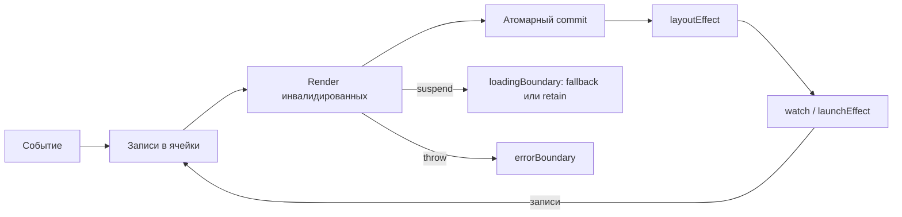

# Kinetica

## Резюме

Если смотреть на официальные материалы React не как на набор API, а как на историю компромиссов, картина довольно ясная: React-команда много раз выбирала **добавочные** решения вместо радикального переписывания семантики. Hooks были выпущены как **opt-in** и **“100% backwards-compatible”** с существующим кодом; переход к Concurrent React сопровождался отдельным акцентом на **gradual adoption**; новые возможности вроде `useEffectEvent`, `use`, `useSyncExternalStore` и React Compiler тоже подаются как эволюционные надстройки, а не как обнуление старой модели. Это очень прагматично для огромной экосистемы — но одновременно означает, что ряд исторических шероховатостей React уже слишком глубоко встроен в публичный контракт, документацию, обучающие материалы, линтеры, сторонние библиотеки и ментальную модель миллионов приложений.

Самые важные ограничения, которые React-авторы сами документировали или прямо обсуждали, выглядят так: ручные dependency arrays и stale closures; позиционная идентичность Hooks и правило “только на верхнем уровне”; синхронный контракт клиентских компонентов и сложная Suspense-модель для async; привязка сохранения state к позиции в дереве; coarse-grained invalidation у context; сохранение классов как легаси-носителя для части возможностей вроде Error Boundary и `getSnapshotBeforeUpdate`; а также особые компромиссы для внешних mutable stores при concurrent rendering. Все эти ограничения либо прямо названы drawback’ами в RFC, либо описаны в current docs как ограничения без прямого эквивалента, либо обходятся новыми добавочными API вместо смены основного контракта.

Ниже — **вторая ревизия** спецификации Kotlin-фреймворка **Kinetica** (название отражает целевой дизайн: не “позиционные хуки” и “effect soup”, а **ясная кинетика состояния, событий и задач**). Относительно первой ревизии зафиксированы три решения. Во-первых, конкуррентный слой исполнения — transitions, приоритетные lanes, многоверсионные stores, спекулятивный рендер — **вырезан** в пользу линейной, дебажимой модели с одним UI-loop. Во-вторых, закрыты архитектурные дыры универсального фреймворка: навигация, exit-lifecycle узлов, семантика/фокус в дереве, ленивые списки, петля инвалидации данных. В-третьих, **компиляторный плагин принят как штатная часть toolchain** — ради hot reload с сохранением state, превью, skipping-оптимизаций, упрощения кода и server components. Формы, анимации, роутер и data-слой — first-party батарейки поверх контрактов ядра. Отдельный раздел объясняет, чем Kinetica отличается от Jetpack Compose — ближайшего существующего “Kotlin-ответа React”. Важно: это по-прежнему **исследовательская спецификация**, а не описание существующего продукта; базовая платформа — **Kotlin Multiplatform core** с pluggable renderer’ами для JVM, Android, web/Wasm и native targets.

## Цели и non-goals

### Цели

1. **Идиоматичный, простой Kotlin-код приложений.** Boilerplate снимает компиляторный плагин; `suspend`, делегаты и data classes — рабочие инструменты API, а не декорации.
2. **Маленький ортогональный API**: одна реактивная ячейка, три эффекта, две boundary, обязательные ключи. Без зоопарка политик.
3. **Простые приложения пишутся просто** — todo-app не касается ни одной продвинутой концепции; сложность раскрывается прогрессивно.
4. **Линейная причинность**: один UI-loop, синхронный атомарный commit, журнал событий, детерминированный реплей. Всё, что произошло, объяснимо и воспроизводимо.
5. **Лексическая идентичность state** — именованные слоты со стабильными `SlotId`; state-preserving hot reload, персистентность и превью — нормативные следствия, а не удача.
6. **`suspend` — единственная async-модель**: suspend-компоненты, `loadingBoundary`, structured concurrency. Без promise-throwing.
7. **UI — сериализуемое значение**: дерево `Node` печатается, диффается, снапшот-тестируется, передаётся по сети и отдаётся ИИ-агенту как данные.
8. **Server components на языке, а не на протоколе**: серверный компонент — suspend-функция на JVM, возвращающая `Node`; границу генерирует и валидирует плагин. Без строковых директив и bundler-протокола.
9. **Компиляторный плагин — штатная часть toolchain**: SlotId, desugaring, skipping, server/client-граница, hot reload, превью. Магия допустима, если она детерминирована, документирована и наблюдаема.
10. **Наблюдаемость — контракт ядра**: render-cause и причины рестарта эффектов — машиночитаемые штатные сигналы; виртуальное время в тестах.
11. **AI-legibility**: headless runtime, UI-состояние как данные, реплей по журналу — агент запускает, инспектирует и проверяет приложение без человека у экрана.
12. **Универсальные потребности — в ядре, если ретрофит дорог**: навигация/back stack, exit-lifecycle, семантика/a11y/фокус, `lazyEach`, инвалидация `resource` ↔ `action`.
13. **Батарейки first-party** — router, motion, forms, data, persist, theme — поверх стабильных контрактов ядра, но не внутри него.
14. **Безопасная server/client-граница по умолчанию**: недоверенные аргументы, только DTO со схемой, экранирование из коробки.

### Non-goals

1. **Обратная совместимость с React** — соответствие концептуальное (для переноса мышления и кода ИИ-инструментами), не API-уровня.
2. **Concurrent rendering** — time-slicing, lanes, transitions, многоверсионные stores. Ставка на мелкозернистые подписки и фоновые корутины; узкий `deferred` можно добавить позже, планировщик «на вырост» — нельзя.
3. **Производительность масштаба Meta как критерий дизайна** — простота и дебажимость важнее последних процентов throughput.
4. **Универсальный эффект «сделай что-нибудь после рендера»** — эффекты специализированы.
5. **Классы как носители lifecycle.**
6. **Внешние mutable stores как first-class граждане** — адаптеры в реактивную ячейку, без протечки их ограничений в ядро.
7. **Собственный DI-контейнер** — `context` передаёт значения по дереву, DI — внешний.
8. **Собственная build-инфраструктура** — живём в Gradle/KMP; плагин — часть компиляции, а не свой bundler/CLI.
9. **Автоматическая миграция существующих Compose/React-приложений** — interop-острова есть, обещания «перепишется само» нет.

## Где React упирается в собственную историю

### Эффекты, stale closures и ручные dependency arrays

Hooks RFC сам перечисляет как drawback то, что event handlers пересоздаются на каждом render, а closures в `useEffect` и `useCallback` могут захватывать старые версии props/state; отдельно там же сказано, что правила Hooks и такие closures могут делать рефакторинг менее очевидным. Официальный FAQ и правило `exhaustive-deps` в документации затем фиксируют это уже как повседневную реальность: если зависимость пропущена, эффект продолжит видеть устаревшие значения; если вы “боретесь” с линтером, структура кода, скорее всего, выбрана неудачно. React 19.2 добавил `useEffectEvent` именно для того, чтобы отделить “не-реактивную” часть логики от эффекта и дать доступ к latest values без лишнего re-subscribe. То есть сама команда фактически признала, что исходный ergonomics `useEffect` для такого кейса далёк от идеала, и ответила не изменением старой семантики, а новым API поверх неё.

Почему так вообще получилось: `useEffect` был задуман как единый механизм для синхронизации с внешними системами, а не как буквальная замена lifecycle-методов. Современная документация React специально подчёркивает, что Effects — это **escape hatch** и что во многих случаях “effect не нужен”, а логика должна жить либо в render, либо в events. Более того, React в dev-режиме в Strict Mode сознательно делает дополнительный setup→cleanup→setup цикл, чтобы раньше проявлялись ошибки cleanup-логики. Фактически React учит разработчика обходить чрезмерное использование того самого API, который когда-то подался как главная замена lifecycle-подходу.

Почему это уже трудно менять в самом React: Hooks были выпущены как 100% backwards-compatible и быстро стали экосистемным дефолтом; вокруг dependency arrays выросли линтеры, best practices, custom hooks, генераторы кода и теперь уже даже React Compiler. Если бы React сейчас радикально поменял правило restart’а эффектов или semantics captured values, это сломало бы и ожидания пользователей, и большое число существующих custom hooks. Отсюда наблюдаемая стратегия: не отменять старую модель, а постепенно надстраивать поверх неё `useEffectEvent`, новые docs и compiler assistance.

**Цель для нового дизайна:** эффекты должны быть **узкоспециализированными** и **структурированными**; latest-value callbacks — встроенными; зависимость эффекта — одно явное наблюдаемое выражение, а не ручной массив и не скрытая магия.

### Позиционная идентичность Hooks и правило вызова только сверху

Hooks RFC прямо называет drawback’ом “Rules of Hooks”: хуки должны вызываться безусловно, их нельзя двигать в `if`, циклы и helper functions, а добавление раннего `return` может потребовать перестройки всего тела компонента. Современные docs повторяют это почти дословно: Hooks можно вызывать только на верхнем уровне function component или custom hook, и нельзя вызывать в циклах, условиях, `try/catch`, event handlers и т.д. Dan Abramov в отдельном посте объяснял, что Hooks опираются на **persistent call index** между рендерами — то есть идентичность hook state основана не на имени, а на позиции вызова.

Очень показательно, что когда React понадобился новый механизм чтения Promise/context в render, команда выпустила `use`, и docs специально подчёркивают: **несмотря на название, `use` — не Hook**; в отличие от Hooks, его можно вызывать внутри `if` и циклов. React 19 release post отдельно демонстрирует чтение context после early return как кейс, который `useContext` не умеет, а `use` — умеет. Это сильный косвенный сигнал: React понимает ergonomics-проблему call-order model, но не может просто “исправить Hooks”, поэтому добавляет параллельный механизм с другой семантикой.

Почему это нельзя просто поменять в самом React: call-order — не частность реализации, а центральный identity-mechanism Hooks. На нём держатся хранение hook state, hot reloading heuristics, работа большинства custom hooks и линтерных правил. Замена этой модели постфактум означала бы фундаментальное изменение всей hook-экосистемы. Именно поэтому React смог сделать условное чтение только через **новый** API `use`, не объявляя старые Hooks “теперь тоже можно вызывать условно”.

**Цель для нового дизайна:** отказ от позиционной идентичности в пользу **лексически стабильной** или **явно именованной** идентичности state/effect slots.

### Асинхронная модель React остаётся разделённой и неровной

Сегодняшний React по-прежнему **не поддерживает arbitrary async client components**. Официальный error text прямо говорит: “Only Server Components can be async at the moment”; ещё один error отдельно предупреждает, что hooks не поддерживаются внутри async component на клиенте. React Labs в 2023 году сформулировал это ещё откровеннее: команда **не может** поддержать `async/await` “в произвольных компонентах в client-only apps”, и вместо этого развивает Server Components и `use`. Это значит, что базовый render contract на клиенте у React всё ещё исторически синхронный.

Отсюда вырастают вторичные сложности. `use(promise)` требует, чтобы promise был **cached** и переиспользовался между рендерами; если promise создаётся прямо в render client component, Suspense fallback будет вспыхивать на каждый re-render. `use` нельзя оборачивать в `try/catch`; Suspense вообще не замечает data fetching, запущенный внутри Effect или event handler — только Suspense-enabled sources. Итого async-модель React остаётся смесью синхронных клиентских компонентов, promise-throwing semantics, специальных boundaries и framework-level caching.

Почему это трудно радикально менять в React: если миллионы существующих client components рассчитаны на синхронную функцию render и действующие правила Hooks, то переход к “любая клиентская компонента может `await`” меняет и lifecycle ожидания, и error propagation, и scheduler contract, и поведение библиотек. React поэтому идёт обходным путём: async на сервере, `use` как отдельный render-time reader, Server Functions как специальный мост с bundler directives.

**Цель для нового дизайна:** `suspend` как **обычная** форма компонента и эффекта, без throwing promises как пользовательской модели.

### Идентичность state в React зависит от позиции в дереве

Официальная документация React формулирует это без экивоков: React связывает state с компонентом **по месту в UI tree**. Если структура дерева “не match up”, state уничтожается; если компонент такого же типа остаётся на той же позиции, state сохраняется. Именно поэтому смена компонента в той же позиции может неожиданно сохранить state там, где разработчик воспринимает это как “совсем другой объект”, а вложенное определение component function вообще может приводить к постоянному reset’у state. React рекомендует использовать `key`, если нужно явно reset/preserve.

Почему это исторически так: reconciliation в React строится вокруг сопоставления прежнего и нового дерева, и “позиция + type + key” стали общеизвестной identity-моделью. Почему менять опасно: любое изменение правила сохранения state изменило бы поведение реально существующих приложений — иногда без ошибок компиляции и без runtime exception, просто тихо сохранив там, где раньше reset, или наоборот. Это один из самых болезненных типов back-compat breakage, потому что он меняет бизнес-состояние UI.

**Цель для нового дизайна:** сделать идентичность **более явной**, а для динамических списков — по возможности обязательной.

### Context в React по умолчанию грубозернистый

Current docs по `useContext` говорят, что React автоматически re-render’ит **всех** детей, которые читают данный context, начиная с provider’а, если `value` изменился; отдельно docs по `memo` подчёркивают, что memoization **не предотвращает** re-render компонента, если изменился читаемый им context. Ещё до Hooks RFC нового context прямо называл flaw старого контекста и обсуждал subscription-подходы как дорогие и неудобные, но базовая модель `useContext` в итоге всё равно осталась coarse-grained: read entire value, invalidate all readers.

Почему это существует: простая модель “изменился provider value — обновить всех readers” делает семантику предсказуемой и не требует selector protocol в ядре. Почему трудно поменять: selector-based semantics меняют момент и частоту re-render’ов, а значит и observable behavior пользовательских приложений; кроме того, вокруг текущей модели уже построены memo patterns, splitting contexts, third-party selector libraries и ожидания от propagation. React поэтому предпочитал оставлять ядро простым, а fine-grained cases смещать в userland и ecosystem.

**Цель для нового дизайна:** подписка на фрагмент значения должна выражаться **штатной композицией примитивов** (`derived` поверх context), а не внешним паттерном и не отдельным selector-API.

### Функции не полностью заменили классы, а классы несут исторический багаж

React docs по `Component` прямо пишут, что у function components **пока нет** прямого эквивалента для `componentDidCatch`, `static getDerivedStateFromError` и `getSnapshotBeforeUpdate`; если нужен `getSnapshotBeforeUpdate`, “for now you’ll have to write a class component”. Это очень сильное признание: даже после эпохи “пишите функции и Hooks”, часть жизненно важных крайних случаев всё ещё живёт в классовом API.

Параллельно React Lifecycle RFC называл старые lifecycle hooks “error-prone” и небезопасными для async rendering, а блог “Update on Async Rendering” подчёркивал постепенную миграцию, переименование в `UNSAFE_` и необходимость времени даже для самого Facebook. В RFC отдельно сказано, что смена lifecycle API создаст **много churn** и даже “не fully backwards compatible”. Иными словами: React-команда и сама не считала прежний lifecycle-дизайн удачным, но уже не могла просто выкинуть его без долгой совместимой миграции.

**Цель для нового дизайна:** никаких классов как носителей UI-lifecycle; только function-style boundaries и фазовые, типизированные эффекты.

### Внешние mutable stores и concurrent rendering плохо сочетаются

RFC `useSyncExternalStore` необычно откровенен. Команда пишет, что предыдущее направление (`useMutableSource`) могло приводить к тому, что уже видимый UI неожиданно заменяется fallback’ом; после экспериментов команда решила, что это неправильный trade-off. Причина фундаментальна: React умеет держать несколько версий UI для built-in state (`useState`, `useReducer`), но не для state вне React, потому что типичный внешний store даёт только “current state”, а не “background state”. Поэтому `useSyncExternalStore` сознательно делает store updates **always synchronous**, жертвуя частью time-slicing ради консистентности и UX.

Почему это трудно “по-настоящему исправить” внутри React: ядро React не контролирует чужие store implementations. Если внешний store не умеет versioned snapshots, React не может магически изобрести их на своей стороне. Поэтому и здесь решение получилось добавочным и компромиссным: специальный hook, синхронные обновления store, официальный совет использовать built-in React state для transitions.

**Цель для нового дизайна:** не воспроизводить проблему вовсе — один UI-loop с синхронным commit снимает вопрос версионирования; внешние источники адаптируются в реактивную ячейку.

### Сводная матрица проблем и целевых исправлений

| Боль React | Почему она существует | Почему её трудно менять в React | Цель для Kinetica |
|---|---|---|---|
| `useEffect` + deps + stale closures | Единый escape hatch для синхронизации, основанный на closure semantics и ручных dependency arrays  | На этих правилах уже построены custom hooks, линтеры, docs и compiler assistance  | Разделённые effect-праймитивы, явный `watch` с одним выражением-источником, latest-value events |
| Call-order Hooks | Hook identity основана на позиции вызова  | Это публичная и экосистемная основа Hooks | Лексическая идентичность slots, conditional state/effects |
| Async client model | Исторически синхронный render contract клиента  | Смена повлияла бы на hooks, scheduler, libraries и hydration | `suspend`-компоненты везде |
| State tied to tree position | Reconciliation сохраняет state по tree position/type/key  | Тихо изменило бы пользовательское состояние в существующих приложениях | Более явная identity-модель и обязательные keys для динамики |
| Context invalidates all readers | Простая propagation model без selectors в ядре  | Selector semantics изменила бы observable re-render behavior | `derived` поверх context + плагинный skipping |
| Class-only escape hatches | Исторический class API так и остался для части кейсов  | Много легаси-кода и долгий migration tail  | Function-style boundaries и фазовые эффекты |
| External stores vs concurrency | Внешние stores обычно не versioned  | React не контролирует чужой store protocol | Один UI-loop, синхронный commit — версии не нужны; адаптеры в ячейку |

## Принципы Kinetica

Kinetica — **Kotlin-first UI runtime**, вдохновлённый React, но спроектированный по собственным целям (см. «Цели и non-goals»). Пять принципов:

**1. Линейная причинность важнее конкуррентного рендера.** Событие → запись → рендер → commit → эффекты, в одном UI-loop. Никаких спекулятивных рендеров, приоритетных lanes и многоверсионных snapshot’ов: всё, что произошло, объяснимо журналом, воспроизводимо реплеем и видно в дебаггере. Тяжёлая работа уходит в фоновые корутины и возвращается записью в state — это идиоматичный Kotlin, а не встроенный планировщик «на вырост».

**2. Одна реактивная ячейка.** Локальный state, глобальный store, значение context’а и производное значение — один механизм отслеживаемого чтения. Авто-трекинг живёт только в синхронном мире (render и `derived`), где он корректен и прост; в эффектах зависимость — явное выражение `watch`.

**3. Идентичность — лексическая и стабильная.** Слоты state привязаны к месту декларации, а не к порядку вызова. Стабильный `SlotId` генерирует компиляторный плагин; из этого нормативно следуют hot reload с сохранением state, персистентность и превью.

**4. `suspend` — единственная async-модель.** Компонент, эффект, загрузчик и action могут приостанавливаться; ожиданием управляют boundaries; отмена — structured concurrency. Никаких promise-throwing и второй асинхронной вселенной.

**5. UI — значение.** Результат рендера — сериализуемое дерево `Node`: его можно напечатать, продиффать, снапшот-тестировать, передать по сети (server components) и отдать ИИ-агенту как данные.

### Почему не просто Compose

Со второй ревизии Kinetica разделяет с Compose его главное инженерное решение — обязательный компиляторный плагин. Различия сместились из инструментов в семантику:

- **Идентичность.** Compose использует positional memoization: `remember` привязан к позиции в slot table, группы генерируются по call sites, `key(...)` — escape hatch. Kinetica генерирует **лексические** `SlotId` по декларациям — conditional state легален по построению, а hot reload с сохранением state и персистентность обещаны нормативно, а не эвристически.
- **Эффекты.** `LaunchedEffect(key1, key2)` — те же ручные dependency keys, что и в React. В Kinetica зависимость эффекта — одно наблюдаемое выражение `watch { ... }`, вычисляемое рантаймом.
- **Продукт рендера.** Compose эмитит в slot table через `Applier`; дерево — внутреннее состояние рантайма. В Kinetica рендер производит **сериализуемое значение `Node`** — отсюда снапшот-тесты, превью, headless-инспекция и server components.
- **Модель исполнения.** Compose несёт собственную сложность (recomposition, snapshot-MVCC, стабильность типов как контракт производительности). Kinetica сознательно отказывается и от MVCC: конкуррентность решается корутинами *вне* рендера, а не версиями state внутри него. Первая ревизия этой спеки обобщала снапшоты Compose — вторая признаёт: для целей «просто и дебажится» правильный ответ — один loop, а не версии.
- **Server components.** У Compose их нет; в Kinetica они следуют из сериализуемости `Node` почти бесплатно.

Итог: Compose-подобный toolchain, React-подобная серверная модель, семантика — проще обоих.

### Нормативные допущения спецификации

| Область | Решение |
|---|---|
| Ядро | `kinetica-runtime` в `commonMain` |
| Пакет / group | `io.heapy.kinetica` |
| Toolchain | `kinetica-compiler` — K2 compiler plugin, **штатная часть сборки** |
| Платформы | JVM, Android, JS/Wasm, Native через renderer SPI |
| Синтаксис компонентов | `@UiComponent`-функции; эмиссия в scope; desugar в значение `Node` |
| Реактивность | одна ячейка: `state` / `derived` / `store` / `context` |
| Async | `suspend` как единственная форма render/effect/action |
| Исполнение | один UI-loop, синхронный атомарный commit, журнал событий |
| Серверная модель | сериализуемый `Node` по проводу; границы — source sets + плагин |
| Батарейки | first-party: router, motion, forms, data, persist, theme |
| Вне scope | собственный DI, собственная build-инфраструктура, автоматическая миграция чужих кодовых баз |

## Спецификация ядра

### Компоненты и Node

```kotlin
@UiComponent
fun Hello(name: String) {
    text("Hello, $name")
}
```

Компонент — функция с `@UiComponent`, тело которой **эмитит** узлы. Плагин выполняет desugaring: внедряет `ComponentScope`, собирает эмиссию в immutable-дерево и делает функцию `Node`-производящей:

```kotlin
// концептуальный desugar (не публичный API)
fun Hello(name: String, scope: ComponentScope): Node
```

`Node` — сериализуемое значение:

```kotlin
@Serializable
sealed interface Node {
    val semantics: Semantics?
}
```

- Host-узлы (`column`, `text`, `button`, `textInput`, …) — `@Serializable`-подклассы, объявляемые renderer-модулем.
- `ClientRef` — placeholder клиентского компонента внутри серверного дерева (см. server components).
- Из сериализуемости следуют: `println(node)`, дифф по значению, снапшот-тесты, превью, headless-инспекция, передача по сети.

**Нормативная семантика render.** Компонент pure относительно входов и отслеживаемых чтений. Каждый начатый render **коммитится** — спекулятивных и отбрасываемых рендеров нет; исключения уходят в `errorBoundary`, suspension — в `loadingBoundary`. Компонент может быть `suspend`.

#### Семантика, фокус и направление

```kotlin
@Serializable
data class Semantics(
    val role: Role? = null,
    val label: String? = null,
    val stateDescription: String? = null,
    val focusable: Boolean = false,
    val traversalIndex: Int? = null,
    val testTag: String? = null
)
```

Каждый host-узел принимает `semantics = ...`. Семантическое дерево — часть `Node`, а не приклейка renderer’а: по нему работают скринридеры, focus manager ядра (клавиатура, TV, tab-порядок), тестовые селекторы и девтулы. Направление layout (LTR/RTL) — атрибут окружения; направленные примитивы (`row`) обязаны его уважать.

### Состояние: одна ячейка

```kotlin
interface Cell<out T> { val value: T }              // чтение трекается в render/derived/watch-source
interface MutableCell<T> : Cell<T> {
    override var value: T
    fun update(transform: (T) -> T)
}

context(ComponentScope)
fun <T> state(
    policy: EqualityPolicy<T> = EqualityPolicy.structural(),
    persistent: Boolean = false,
    transient: Boolean = false,
    initial: () -> T
): MutableCell<T>                                    // + делегат: var x by state { ... }

context(ComponentScope)
fun <T> derived(
    policy: EqualityPolicy<T> = EqualityPolicy.structural(),
    compute: () -> T
): Cell<T>

fun <T> store(
    initial: T,
    policy: EqualityPolicy<T> = EqualityPolicy.structural()
): MutableCell<T>                                    // та же ячейка, module-level lifetime
```

#### Нормативная семантика

- **Один механизм трекинга.** Чтение `Cell.value` (или делегата) в render и `derived` подписывает читателя. `store` — это `state`, вынесенный из компонента; отдельного store-API с версиями и подписками нет.
- **Идентичность.** Плагин присваивает каждой декларации стабильный `SlotId(moduleId, functionFqName, declarationOrdinal, disambiguator)`. Source offset в идентичность не входит. Нормативные следствия:
  - правка тела функции сохраняет state по `SlotId` (hot reload);
  - переименование переменной — сброс её слота (осознанная семантика);
  - state можно объявлять после early return и в условных ветках.
- **Лайфтайм условных слотов.** Slot принадлежит инстансу и сохраняет значение, даже если декларация в этом render не исполнялась. `transient = true` освобождает slot при первом commit без исполнения декларации.
- **`persistent = true`** — слот сериализуется по `SlotId` и восстанавливается после process death / перезапуска (бэкенды — в `kinetica-persist`).
- **`derived` glitch-free**: внутри одной render-транзакции читатель не может увидеть обновлённый источник вместе с устаревшим производным. Пересчёт ленивый, мемоизирован. Для больших коллекций выбирайте `referential()` — структурное сравнение на каждый пересчёт это скрытый O(n).

#### Context

```kotlin
fun <T> context(default: T, name: String? = null): Context<T>

context(ComponentScope)
fun <T> provide(context: Context<T>, value: T, content: () -> Unit)

context(ComponentScope)
fun <T> read(context: Context<T>): T                 // трекаемое чтение
```

Отдельного selector-API нет: подписка на фрагмент — штатная композиция `val colors by derived { read(Theme).colors }`. `derived` отсекает распространение по equality, плагинный skipping не рендерит нетронутых потомков — coarse-grained-инвалидация React закрыта двумя ортогональными примитивами вместо третьего специального.

#### Списки: each и lazyEach

```kotlin
context(ComponentScope)
fun <T> each(items: Iterable<T>, key: (T) -> Any, content: (T) -> Unit)

context(ComponentScope)
fun <T> lazyEach(
    items: LazyItems<T>,                             // список или пагинируемый источник
    key: (T) -> Any,
    retain: RetainPolicy = RetainPolicy.Keyed,
    content: (T) -> Unit
)
```

`key` обязателен синтаксически; дубликат key — ошибка в debug, last-wins с warning в production. `lazyEach` — виртуализация как контракт ядра: renderer определяет viewport, ядро гарантирует, что (а) state элементов вне окна не уничтожается, а замораживается по `RetainPolicy`; (б) suspend-элемент показывает placeholder своей ячейки, не блокируя окно; (в) позиция скролла — сериализуемое состояние, участвующее в restoration.

### Эффекты и события

```kotlin
context(ComponentScope)
fun launchEffect(block: suspend EffectScope.() -> Unit): EffectHandle

context(ComponentScope)
fun <T> watch(
    source: () -> T,
    equals: EqualityPolicy<T> = EqualityPolicy.structural(),
    block: suspend EffectScope.(T) -> Unit
): EffectHandle

context(ComponentScope)
fun layoutEffect(block: LayoutScope.() -> Unit)

context(ComponentScope)
fun <A> event(block: EventScope.(A) -> Unit): (A) -> Unit

context(ComponentScope)
fun event(block: EventScope.() -> Unit): () -> Unit

interface EffectScope : CoroutineScope {
    suspend fun awaitDispose(cleanup: suspend () -> Unit = {})
}
```

#### Нормативная семантика

- **`launchEffect`** запускается один раз после первого commit инстанса и отменяется при dispose. Ничего не отслеживает.
- **`watch`** — единственный реактивный эффект. `source` вычисляется в tracked-режиме после каждого commit; если результат изменился (по `equals`), предыдущий `block` отменяется и запускается новый с новым значением. Чтения внутри `block` **не** отслеживаются — это обычная корутина. Прологовое правило первой ревизии («трекаем до первого suspension point») упразднено вместе с диагностиками, которые оно требовало: зависимость видна глазами в самом коде.
- **`layoutEffect`** — синхронно после применения host-мутаций, до кадра; только на UI-loop.
- **`event`** возвращает стабильный callback, видящий последний committed state. Оговорки про draft-снапшоты не нужны — черновиков больше не существует.
- Если `watch` пишет в собственный источник и зацикливается, runtime в debug обрывает цикл и прикладывает trace.
- `peek { ... }` — нетрекаемое чтение в render/`derived`; единственный escape hatch трекинга.

#### Пример

```kotlin
@UiComponent
fun ChatRoom(roomId: RoomId, theme: Theme) {
    val onConnected = event { Notifications.show("Connected", theme) }

    watch({ roomId }) { id ->
        val connection = ChatApi.connect(id)
        connection.onConnected(onConnected)
        awaitDispose { connection.disconnect() }
    }

    text("Room: $roomId")
}
```

#### Refs

```kotlin
context(ComponentScope) fun <T : Any> hostRef(): Ref<T>
context(ComponentScope) fun <T : Any> imperativeHandle(factory: () -> T): Ref<T>
```

Чтение refs в render-фазе запрещено (диагностика плагина); легальные фазы — `layoutEffect` и эффекты.

### Границы, exit-lifecycle и покадровые значения

`errorBoundary` и `loadingBoundary` — как в первой ревизии: функциональные, без классов. Ошибки эффектов доставляются boundary **над местом объявления** эффекта; `loadingBoundary(retainPrevious = true)` удерживает прошлый UI вместо fallback-мигания.

#### Exit-lifecycle

```kotlin
context(ComponentScope)
fun onExit(block: suspend ExitScope.() -> Unit)
```

Когда поддерево удаляется (смена `key`, условная ветка, pop навигации), runtime переводит его в фазу **leaving**: узлы остаются в host-дереве, ввод в них не доставляется, семантика помечена. Dispose откладывается до завершения всех `onExit` (или debug-timeout). Это контракт, на котором `kinetica-motion` строит exit-анимации; без `onExit` удаление немедленно. Урок React усвоен заранее: если ядро не знает про «уходящие» узлы, exit-анимации навсегда остаются костылями уровня AnimatePresence.

#### Покадровые значения

```kotlin
context(ComponentScope)
fun frameValue(initial: Float): FrameValue
```

`FrameValue` пишется с частотой кадров (жесты, физика, скролл-эффекты) и применяется renderer’ом к host-свойству **в обход** render-цикла. Его чтение в render намеренно не трекается: связь с миром state — явный commit финального значения по завершении жеста. Это второй контракт для `kinetica-motion` — анимация не должна гонять рендер на 120 Гц.

#### Жизненный цикл



### Модель исполнения

- **Один UI-loop** (главный dispatcher host-платформы). Записи в ячейки разрешены из любых корутин и потоков — они сериализуются постингом в loop; гонок и tearing нет по построению.
- Цикл: события → батч записей → render только инвалидированных компонентов (подписки + плагинный skipping) → **синхронный атомарный commit** → `layoutEffect` → эффекты.
- Каждый начатый render коммитится. Отброс — только исключение (в `errorBoundary`).
- **Suspend-поддеревья**: если компонент приостановился, остальное дерево коммитится; boundary решает fallback/retention; по готовности поддерево дорендеривается и коммитится отдельно. События продолжают обрабатываться.
- **Журнал** (debug): каждая запись, причина рендера, рестарт эффекта и commit пишутся в ring buffer. Журнал экспортируем — это фундамент реплея, time-travel и AI-инструментов.
- Тяжёлые вычисления не живут в render: их место — фоновые корутины, возвращающие результат записью в ячейку.

### Данные: resource, action, инвалидация

```kotlin
interface ResourceKey                                 // @Serializable data-класс или data object

context(ComponentScope)
fun <K : ResourceKey, T> resource(
    key: K,
    scope: CacheScope = CacheScope.App,               // Component | App | Request (сервер)
    loader: suspend (K) -> T
): Resource<T>

interface Resource<T> {
    suspend fun await(): T
    val state: ResourceState<T>
    fun invalidate()
}

fun invalidate(key: ResourceKey)
fun invalidate(predicate: (ResourceKey) -> Boolean)

context(ComponentScope)
fun <I, O> action(
    invalidates: (I) -> List<ResourceKey> = { emptyList() },
    block: suspend (I) -> O
): Action<I, O>
```

#### Нормативная семантика

- Loader — **single-flight** на ключ в пределах cache scope: два `resource` с одним ключом делят один полёт и одно значение.
- `invalidate(key)` перезагружает все живые ресурсы с этим ключом; их suspend-поддеревья проходят через `loadingBoundary`, по умолчанию с `retainPrevious` — без мигания.
- `action` по успеху инвалидирует объявленные ключи. Это замыкает петлю «показал → изменил → обновил показанное» в ядре: 90% приложений не нуждаются во внешнем data-фреймворке для базового цикла. Пагинация, optimistic updates и offline — в `kinetica-data`.

#### Пример

```kotlin
data class OrdersKey(val userId: UserId) : ResourceKey

@UiComponent
suspend fun OrdersPage(userId: UserId) {
    val orders = resource(OrdersKey(userId)) { api.orders(it.userId) }.await()
    val addOrder = action(invalidates = { listOf(OrdersKey(userId)) }) { draft: OrderDraft ->
        api.createOrder(draft)
    }

    OrdersTable(orders)
    NewOrderForm(onSubmit = event { draft -> addOrder(draft) })
}
```

### Навигация

Back stack — контракт ядра, потому что он пересекается с идентичностью, retention и host-платформой; UI роутера — батарейка.

```kotlin
@Serializable
sealed interface Route

class BackStack<R : Route>(initial: R) : Cell<List<R>> {
    fun push(route: R)
    fun pop(): Boolean
    fun replaceAll(vararg routes: R)
}
```

- `BackStack` — сериализуемая ячейка: текущий стек — значение, история — данные.
- Host-интеграция через renderer SPI: системная «назад» на Android (включая predictive back — на базе exit-lifecycle), browser history и URL на вебе, программная навигация на десктопе.
- `RouteCodec` (Route ↔ URL path/query) плагин генерирует из `@Serializable`-описания роута; deep link — просто десериализация Route.
- Retention: поддерево каждой entry живёт по `RetainPolicy` (по умолчанию: текущий и предыдущий экраны — живые инстансы, глубже — сериализованные persistent-слоты). Скролл-позиции восстанавливаются через `lazyEach`.

## Server components и SSR

Серверная модель Kinetica — следствие двух решений ядра: `Node` сериализуем, а server/client-границу знает компилятор.

```kotlin
// server source set
@UiComponent
suspend fun ProductPage(id: ProductId) {
    val product = resource(ProductKey(id), scope = CacheScope.Request) { catalog.load(it.id) }.await()
    ProductDetails(product)          // shared-компонент — рендерится на сервере
    AddToCartButton(product.id)      // client-компонент — плагин заменит на ClientRef(props)
}
```

#### Нормативная семантика

- **Границы — source sets** (`server` / `client` / `common`): их охраняет сам компилятор Kotlin. Плагин поверх этого валидирует граф на уровне функций и генерирует: `ClientRef`-узлы с сериализованными props, транспортные стабы для `action`, manifest клиентских компонентов.
- **Wire format — сериализованный `Node`** (kotlinx.serialization). Никакого собственного протокола, директив `'use client'` / `'use server'` и bundler-интеграции.
- **Streaming**: suspend-поддеревья отправляются чанками по мере готовности; на клиенте их место держит `loadingBoundary`.
- **Hydration**: клиент десериализует `Node`, монтирует дерево и оживляет `ClientRef`-острова. Refresh с сервера — новый `Node`, клиент диффит его по значению: дерево — данные, дифф — обычная функция.
- **Безопасность**: аргументы серверных `action` — недоверенный ввод (только DTO со schema validation), текст и атрибуты экранируются по умолчанию, транспорт — capability tokens + CSRF, wire-чанки проверяются по integrity hash.

## Компиляторный плагин

Плагин — штатная часть toolchain. Его обязанности исчерпывающе перечислены; всё остальное — работа рантайма:

1. **SlotId** — стабильная лексическая идентичность слотов → hot reload с сохранением state, персистентность, превью.
2. **Desugaring `@UiComponent`** — внедрение scope, сбор эмиссии в `Node`-значение; пользовательский код не пишет ни `context(...)` в сигнатурах, ни `ui { }`-обёрток.
3. **Skipping** — компонент с неизменёнными inputs (по `EqualityPolicy`) не перерендеривается; ручной `memo` не существует.
4. **Static hoisting** — константные поддеревья строятся один раз.
5. **Server/client** — валидация графа на уровне функций, генерация `ClientRef`, транспортных стабов, manifest’а и `RouteCodec`.
6. **Диагностики** — чтение refs в render, side effects в render-фазе, «`watch`-source с нетрекаемыми чтениями».
7. **Hot reload протокол** — пересборка тел функций с ремапом слотов по `SlotId`.
8. **`@Preview`** — генерация preview-entries: компонент → `Node` → скриншот без запуска приложения.

Гарантии, делающие магию приемлемой: desugaring **детерминирован и документирован** (раздел спеки, а не деталь реализации); у ядра есть медленный интерпретирующий референс без плагина — не публичный режим, а инструмент верификации самого плагина; всё, что плагин пропустил при skipping, видно в девтулах как явное событие «skipped». Зависимость от нестабильного K2 plugin API — осознанно принятый риск (см. «Риски»).

## Инструменты

### Тестирование

```kotlin
object KineticaTest {
    fun render(content: @UiComponent () -> Unit): TestRoot
}

interface TestRoot {
    suspend fun awaitIdle()
    fun advanceTimeBy(millis: Long)
    fun node(matcher: SemanticsMatcher): TestNode     // адресация по семантике, не по CSS-подобным селекторам
    fun click(matcher: SemanticsMatcher)
    fun input(matcher: SemanticsMatcher, value: String)
    fun tree(): Node                                  // текущее дерево как значение
    fun journal(): List<JournalEntry>
    fun dispose()
}
```

Виртуальное время, детерминированное завершение эффектов, захват ошибок boundaries — как в первой ревизии. Селекторы работают по семантическому дереву — тот же контракт, что у a11y и девтулов.

### Девтулы

Журнал исполнения — первичный интерфейс девтулов: причины каждого рендера (`prop change`, `cell write`, `resource resume`, `watch restart`), пропуски skipping, фазы leaving, снимки слотов. Линейная модель исполнения делает **time-travel реплей** честной функцией: журнал + снимки слотов воспроизводят сессию детерминированно.

### Hot reload и preview

Нормативный контракт (не «повезло»): правка тела функции сохраняет state по `SlotId`; добавление/удаление деклараций ремапит оставшиеся; переименование переменной сбрасывает её слот. `@Preview`-компоненты рендерятся в `Node` без приложения и хоста.

### AI-legibility

Фреймворк проектируется так, чтобы его runtime мог читать и проверять агент: headless-рендер возвращает `Node` как данные; события подаются программно; журнал экспортируется и реплеится; render-cause — машиночитаемый ответ на «почему перерендерилось». Небольшой ортогональный API — сам по себе фича этого рода: меньше поверхности — меньше галлюцинаций при генерации кода.

## Батарейки

First-party модули поверх контрактов ядра. В ядро не входят — но проектируются вместе с ним, чтобы контракты были достаточными:

| Модуль | Содержимое | Контракты ядра, на которых стоит |
|---|---|---|
| `kinetica-router` | `NavHost`, типобезопасные аргументы (Route — data class), deep links, анимации переходов, scroll restoration | `BackStack`, exit-lifecycle, `RouteCodec`, `lazyEach` |
| `kinetica-motion` | `animate` (spring/tween), enter/exit-переходы, gesture-driven анимации, прерываемость | exit-lifecycle (`onExit`), `frameValue` |
| `kinetica-forms` | `FormState`, field-делегаты, suspend-валидаторы, two-way `textInput(value = ::draft)` | синхронное эхо текстового ввода (гарантия одного loop — без прыжков курсора и поломок IME) |
| `kinetica-data` | пагинация, optimistic updates, offline-кэш, retry-политики | `resource` / `action` / `invalidate` |
| `kinetica-persist` | бэкенды persistent-слотов: DataStore, localStorage, NSUserDefaults; state restoration | `persistent`-слоты, сериализация по `SlotId` |
| `kinetica-theme` | дизайн-токены, dark mode, breakpoints, RTL-хелперы | `context` + direction-aware layout |

## Память

- Слоты — компактная slot table на инстанс; никаких multiversion-хранилищ: значение у ячейки одно.
- Журнал — ring buffer, включён в debug; в production — opt-in с сэмплированием.
- Resource cache живёт по `CacheScope`; глобальный кэш — только `App` со слабыми ссылками и TTL.
- Unmount поддерева обязан отменить child-скоупы корутин и освободить refs/disposables; фаза leaving удерживает поддерево строго до завершения `onExit`.
- `event`-объекты стабильны и перенаправляют вызов в последний committed closure — длинные графы устаревших захватов не удерживаются.

## Сопоставление с React и миграция

### Таблица соответствий

| React / экосистема | Kinetica | Комментарий |
|---|---|---|
| `function Component(props)` | `@UiComponent fun Component(props)` | может быть `suspend` |
| `useState` | `var x by state { ... }` | лексический слот, не позиция |
| `useReducer` | `state` + обычная функция, либо `store()` | |
| `useMemo` | `val x by derived { ... }` | glitch-free, без deps |
| `useCallback` | `event { ... }` | stable + latest values |
| `useEffect` | `watch(source) { }`, `launchEffect { }`, `layoutEffect { }` | явный источник вместо deps-массива |
| `useEffectEvent` | `event { ... }` | базовый примитив |
| `useContext` | `read(ctx)`, фрагмент — `derived { read(ctx).x }` | |
| `useRef` | `hostRef()` / `imperativeHandle()` | чтение в render запрещено |
| `<Suspense>` + `use(promise)` | `suspend`-компонент + `loadingBoundary` | без promise-throwing |
| Error boundary class | `errorBoundary { ... }` | |
| `useSyncExternalStore` | `store()` | один loop — версии не нужны |
| `useTransition` / `useDeferredValue` | — | non-goal; тяжёлое — в фоновые корутины |
| `React.memo` | — | плагинный skipping, автоматически |
| `key` | `each` / `lazyEach` `(key = ...)` | обязателен синтаксически |
| React Router / Next router | `BackStack` (ядро) + `kinetica-router` | |
| React Query / SWR | `resource` / `action` / `invalidate` (ядро) + `kinetica-data` | |
| framer-motion / AnimatePresence | `kinetica-motion` | поверх exit-lifecycle и `frameValue` |
| react-hook-form | `kinetica-forms` | |
| RSC + `'use client'` | source sets + плагин; `Node` по проводу | без директив и bundler-протокола |

### Три показательных переноса

**Счётчик** — механика формы:

```kotlin
@UiComponent
fun Counter() {
    var count by state { 0 }
    button(onClick = event { count += 1 }) { text("$count") }
}
```

**Эффект с подпиской** — deps-массив становится выражением:

```jsx
// React
useEffect(() => {
  const conn = connect(roomId)
  conn.on('connected', () => notify(theme))
  return () => conn.disconnect()
}, [roomId, theme])
```

```kotlin
// Kinetica: theme не перезапускает подключение — он нужен только в момент события
val onConnected = event { notify(theme) }

watch({ roomId }) { id ->
    val conn = connect(id)
    conn.onConnected(onConnected)
    awaitDispose { conn.disconnect() }
}
```

**Данные с мутацией** — React Query-петля средствами ядра:

```kotlin
@UiComponent
suspend fun TodoScreen(userId: UserId) {
    val todos = resource(TodosKey(userId)) { api.todos(it.userId) }.await()
    val toggle = action(invalidates = { listOf(TodosKey(userId)) }) { id: TodoId ->
        api.toggle(id)
    }

    each(todos, key = { it.id }) { todo ->
        TodoRow(todo, onToggle = event { toggle(todo.id) })
    }
}
```

## Риски

Симметрично к анализу React — слабые места самого дизайна:

- **Компиляторный плагин** — теперь не опция, а несущая стена: стабильного публичного API у K2-плагинов нет, это принятая зависимость от JetBrains. Митигации: desugaring документирован как часть спеки; интерпретирующий референс ядра верифицирует плагин; объём плагина ограничен восемью перечисленными обязанностями — «ползучих» способностей у него быть не должно.
- **Один UI-loop** — при по-настоящему тяжёлом синхронном обновлении возможен пропуск кадра. Митигации: мелкозернистые подписки и skipping делают рендеры маленькими; тяжёлое уходит в корутины; анимации живут на `frameValue` мимо рендера. Если предел будет достигнут — добавим узкий `deferred`, а не вернём планировщик.
- **Skipping как неявная оптимизация** — «почему не перерендерилось» так же важно, как «почему перерендерилось»; девтулы обязаны показывать пропуски явно.
- **Батарейки** — риск расползания ядра. Правило: батарейка не может требовать нового контракта ядра задним числом; контракты (exit-lifecycle, `frameValue`, ключи инвалидации, семантика) проектируются вместе с батарейками, но фиксируются в спеке ядра.

## Сводка

| Тезис | Формулировка |
|---|---|
| Состояние | Одна реактивная ячейка; лексические именованные слоты |
| Эффекты | `watch` с явным выражением-источником; `launchEffect`; без deps-массивов и прологовой магии |
| События | Stable identity + latest committed values |
| Async | `suspend` везде: компоненты, ресурсы, actions |
| Исполнение | Один UI-loop, атомарный commit, журнал, реплей |
| UI | `Node` — сериализуемое значение: тесты, превью, server components, AI |
| Toolchain | Плагин: SlotId, desugaring, skipping, границы server/client, hot reload, превью |

Если проект действительно создаётся “по мотивам React, но уже без его исторических ограничений”, то именно такой вектор — наиболее последовательный: взять у React декларативное дерево и boundaries, у Compose — компиляторный toolchain, у Kotlin — `suspend` и мультиплатформенность, и отказаться от того, что каждый из них тащит по историческим причинам.

## Источники

Материалы, на которые опирается анализ (в исходной версии отчёта ссылки были нечитаемыми экспорт-артефактами вида `citeturn…`; здесь они заменены явным списком):

- React Hooks RFC #68 — github.com/reactjs/rfcs, `text/0068-react-hooks.md`
- React RFC #147 (`useMutableSource` → `useSyncExternalStore`) и его обсуждение — github.com/reactjs/rfcs
- react.dev: справка `useEffect`, `useContext`, `memo`, `Component`, `use`, `useSyncExternalStore`; гайды “Preserving and Resetting State”, “You Might Not Need an Effect”, “Synchronizing with Effects”, “Rules of Hooks”; справка Server Components / Server Functions
- React Labs: “What We’ve Been Working On — March 2023” (react.dev/blog)
- Посты релизов React 19 и React 19.2 (react.dev/blog)
- Dan Abramov, “Why Do Hooks Rely on Call Order?” (overreacted.io)
- “Update on Async Rendering” (legacy.reactjs.org/blog, 2018)
- Kotlin docs: coroutines и suspending functions, cancellation, `Flow`, delegated properties, Kotlin Multiplatform (kotlinlang.org/docs)
- Jetpack Compose: positional memoization и `remember`, snapshot system, `LaunchedEffect`, `CompositionLocal`, Compose compiler plugin (developer.android.com/jetpack/compose)
